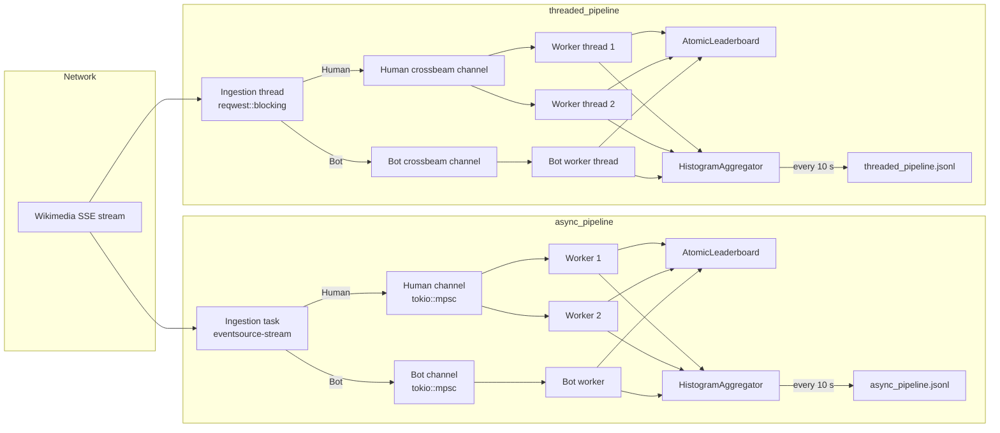

# RTS Wiki Pipeline

Real-time Wikipedia Recent Changes pipeline — Rust concurrency & real-time scheduling assignment.

Processes live SSE events from [stream.wikimedia.org](https://stream.wikimedia.org/v2/stream/recentchange),
routes them by priority (human vs bot edits), maintains a leaderboard of the top 3 most-active wiki
domains, and emits structured JSONL telemetry.

---

## Architecture



---

## Crates

| Crate | Role |
|---|---|
| `rts_core` | Shared types, zero-copy parser, `TrackingAllocator`, HDR histograms, leaderboard |
| `async_pipeline` | Tokio async ingestion + priority processing + HDR metrics |
| `threaded_pipeline` | `std::thread` + `reqwest::blocking` ingestion (no Tokio on hot path) |
| `benches` | Criterion benchmarks: parsing, leaderboard contention, e2e latency replay |

---

## Quick Start

### Prerequisites

- Rust stable (≥ 1.75)
- Python ≥ 3.9 with `pip install pandas matplotlib`

### Build

```bash
cargo build --workspace
```

### Run async pipeline (60 s live capture)

```bash
cargo run -p async_pipeline -- --duration 60 --log logs/async_pipeline.jsonl
```

### Run threaded pipeline (60 s live capture)

```bash
cargo run -p threaded_pipeline -- --duration 60 --log logs/threaded_pipeline.jsonl
```

### Run all unit tests

```bash
cargo test --workspace
```

### Run Criterion benchmarks

```bash
# Full benchmark suite (takes ~5 min)
cargo bench --workspace

# Compile-check only (fast)
cargo bench --workspace --no-run
```

### Allocation audit

```bash
# Async pipeline (current_thread runtime — noise-free)
cargo run -p async_pipeline --features track-alloc -- \
    --duration 30 --log logs/async_audit.jsonl

python scripts/allocation_audit.py \
    --log logs/async_audit.jsonl \
    --out reports/allocation_audit.txt \
    --fig reports/figures/allocation_audit_async.png

# Threaded pipeline
cargo run -p threaded_pipeline --features track-alloc -- \
    --duration 30 --log logs/threaded_audit.jsonl

python scripts/allocation_audit.py \
    --log logs/threaded_audit.jsonl \
    --out reports/threaded_allocation_audit.txt \
    --fig reports/figures/allocation_audit_threaded.png
```

### Analysis plots

```bash
# Latency by priority
python scripts/analyze_latency.py logs/async_pipeline.jsonl
python scripts/analyze_latency.py logs/threaded_pipeline.jsonl

# Drift histograms
python scripts/plot_drift.py logs/async_pipeline.jsonl
python scripts/plot_drift.py logs/threaded_pipeline.jsonl

# Overflow timeline
python scripts/plot_overflow.py logs/async_pipeline.jsonl
python scripts/plot_overflow.py logs/threaded_pipeline.jsonl

# Failsafe / rolling p99 timeline
python scripts/plot_failsafe.py logs/async_pipeline.jsonl
python scripts/plot_failsafe.py logs/threaded_pipeline.jsonl

# Architecture comparison (requires both JSONL logs)
python scripts/compare_architectures.py \
    logs/async_pipeline.jsonl logs/threaded_pipeline.jsonl
```

---

## Output Reference

| File | Description |
|---|---|
| `logs/async_pipeline.jsonl` | Structured telemetry from the async pipeline run |
| `logs/threaded_pipeline.jsonl` | Structured telemetry from the threaded pipeline run |
| `reports/allocation_audit.txt` | Async zero-allocation audit (target ≥ 95 %) |
| `reports/threaded_allocation_audit.txt` | Threaded allocation audit (conservative lower bound) |
| `reports/figures/latency_by_priority_async.png` | Human vs bot latency CDFs — async |
| `reports/figures/latency_by_priority_threaded.png` | Human vs bot latency CDFs — threaded |
| `reports/figures/drift_histogram_async.png` | Scheduling drift distribution — async |
| `reports/figures/drift_histogram_threaded.png` | Scheduling drift distribution — threaded |
| `reports/figures/overflow_timeline_async.png` | Ring-buffer overflow events — async |
| `reports/figures/overflow_timeline_threaded.png` | Ring-buffer overflow events — threaded |
| `reports/figures/failsafe_timeline_async.png` | Rolling p99 and degraded-mode transitions — async |
| `reports/figures/failsafe_timeline_threaded.png` | Rolling p99 and degraded-mode transitions — threaded |
| `reports/figures/arch_comparison.png` | Side-by-side HDR histogram comparison |

---

## JSONL Log Schema

Each line is a JSON object with a `target` field that identifies the record type:

| `target` | Fields | Meaning |
|---|---|---|
| `summary` | `e2e_latency_human`, `e2e_latency_bot`, `drift_human`, … | HDR histogram snapshot (every 10 s) |
| `deadline_miss` | `latency_us`, `priority`, `drift_us` | Single event that exceeded its deadline |
| `overflow` | `priority`, `dropped` | Ring-buffer overflow — event dropped |
| `bot_dropped_degraded` | — | Bot event shed during degraded mode |
| `alloc_audit` | `zero_alloc`, `alloc_count`, `alloc_bytes` | Per-event allocation snapshot (track-alloc only) |
| `leaderboard` | `rank`, `domain`, `count` | Top-3 leaderboard snapshot |
| `jitter_baseline` | `p50_us`, `p99_us`, `max_us` | OS scheduler jitter measured at startup |

---

## Grading Criterion Map

| Criterion | Where to look |
|---|---|
| Zero-copy parsing | `crates/rts_core/src/parser.rs`, `crates/rts_core/src/event.rs`, `reports/allocation_audit.txt` |
| Priority scheduling (human vs bot) | `crates/rts_core/src/event.rs` (`Priority`), `crates/async_pipeline/src/dispatcher.rs`, `crates/threaded_pipeline/src/dispatcher.rs` |
| Real-time deadline tracking | `crates/rts_core/src/metrics.rs` (`HistogramAggregator`), `reports/figures/latency_by_priority_*.png` |
| Concurrency model (async) | `crates/async_pipeline/src/` — Tokio tasks, `mpsc` channels, `Arc<AtomicLeaderboard>` |
| Concurrency model (threaded) | `crates/threaded_pipeline/src/` — `std::thread`, `crossbeam_channel`, `crossbeam_queue` |
| Allocation audit | `crates/rts_core/src/allocator.rs`, `scripts/allocation_audit.py`, `reports/allocation_audit.txt` |
| Benchmarks | `crates/benches/benches/`, Criterion HTML in `target/criterion/` |
| Analysis & plots | `scripts/`, `reports/figures/` (12 PNGs) |
| Honest limitations | `HONEST_LIMITATIONS.md` |
| API documentation | `cargo doc --workspace --no-deps --open` |
